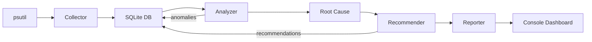

# 🖥️ System Performance Analyzer

An intelligent performance monitoring tool that collects real-time OS metrics, detects anomalies using statistical methods, performs root cause analysis, and generates optimization recommendations — all in Python with **zero ML/LLM dependencies**.


---

## ✨ Features

### 📊 Real-Time Monitoring
- CPU (overall, per-core, frequency, load average)
- Memory & Swap usage
- Disk I/O rates and storage utilization
- Per-process metrics (CPU%, memory, threads, I/O)
- Color-coded console dashboard with ASCII progress bars

### 🔍 Intelligent Anomaly Detection
- **Context-aware baselines** — learns what's "normal" for different times (weekday morning vs weekend night)
- **Z-score based detection** — flags statistically unusual behavior with severity levels (low → critical)
- **Memory leak detection** — identifies sustained memory growth using rolling window analysis
- **Swap thrashing detection** — catches excessive swap activity that kills performance

### 🕵️ Root Cause Analysis
- **Timeline reconstruction** — shows metric changes leading up to an anomaly
- **Process contribution ranking** — identifies which processes caused the spike
- **Process tree tracing** — traces responsibility up the parent process chain
- **I/O pattern analysis** — classifies read/write patterns (e.g., small random reads → missing DB index)

### 💡 Smart Recommendations (5 Rule-Based Heuristics)

| # | Recommendation | Trigger | Example |
|---|---------------|---------|---------|
| 1 | **Database Index** | DB process with high random I/O | *"postgres doing 18K small reads/sec → add index"* |
| 2 | **Memory Upgrade** | RAM >85% + swap pressure | *"Upgrade from 16 GB to 32 GB"* |
| 3 | **Chrome Tab Management** | Browser memory >3 GB | *"26 tabs using 4.8 GB → close/suspend tabs"* |
| 4 | **Docker Resource Limits** | Containers >30% RAM | *"Set --memory=2g per container"* |
| 5 | **Build Optimization** | Compiler + low CPU utilization | *"Use make -j8 for 5x faster builds"* |

### 📈 Reports
- On-demand summary reports for any time range
- CPU/memory/disk statistics with trends
- Anomaly history and active recommendations

---

## 🚀 Quick Start

### Prerequisites
- Python 3.9+

### Installation

```bash
git clone https://github.com/yourusername/system-performance-analyzer.git
cd system-performance-analyzer
pip install -r requirements.txt
```

### Usage

```bash
# Start real-time monitoring dashboard
python monitor.py

# Verbose/debug mode
python monitor.py --verbose

# Generate 24-hour summary report
python monitor.py --report

# Report for a specific date range
python monitor.py --report --start-time "2026-02-10" --end-time "2026-02-11"

# Use custom config file
python monitor.py --config ./my_config.json
```

### Dashboard Preview

```
═══════════════════════════════════════════════════════════════
  SYSTEM PERFORMANCE MONITOR
  Time: 2026-02-12 00:06:18  | Cycle: 13
═══════════════════════════════════════════════════════════════

  SYSTEM METRICS:
  CPU:      2.3%  [█                       ]  Load: 0.0, 0.0, 0.0
  Memory:  64.8%  [███████████████         ]  9.9 GB / 15.3 GB
  Swap:    13.3%  [███                     ]  612.6 MB / 4.5 GB
  Disk:    Read: 87 KB/s  Write: 123 KB/s
  Storage: 79.6%  [███████████████████     ]  360.1 GB / 452.3 GB

  TOP PROCESSES (by CPU):
      PID  Name                  CPU%     Memory  User
  ──────────────────────────────────────────────────────
    10144  python.exe           61.3%    38.7 MB  LAPTOP-59Q1G5SV
    27808  Antigravity.exe      25.9%   540.8 MB  LAPTOP-59Q1G5SV
     2156  dwm.exe               7.8%    77.5 MB  unknown
     5944  mongod.exe            2.4%    35.2 MB  unknown
     6496  oracle.exe            1.8%   984.6 MB  unknown

  Press Ctrl+C to stop  |  DB size: 0.2 MB
═══════════════════════════════════════════════════════════════
```

---

## 📁 Project Structure

```
system-performance-analyzer/
├── src/
│   ├── __init__.py           # Package init
│   ├── collector.py          # Metrics collection via psutil
│   ├── storage.py            # SQLite database manager (5 tables)
│   ├── analyzer.py           # Statistical analysis & anomaly detection
│   ├── root_cause.py         # Root cause analysis engine
│   ├── recommender.py        # Optimization recommendation engine
│   ├── reporter.py           # Console dashboard & report generation
│   └── utils.py              # Formatting helpers & config loader
├── config/
│   └── config.json           # Configuration settings
├── monitor.py                # Main entry point & CLI
├── requirements.txt          # Python dependencies
└── README.md
```

---

## ⚙️ Configuration

Edit `config/config.json` to customize behavior:

```json
{
  "collection": {
    "interval_seconds": 5,         // How often to collect metrics
    "enable_process_metrics": true, // Track per-process data
    "max_processes_tracked": 500    // Max processes per cycle
  },
  "analysis": {
    "baseline_history_days": 7,     // Days of history for baselines
    "anomaly_severity_levels": {
      "low": 1.5,                   // Z-score thresholds
      "medium": 2.0,
      "high": 2.5,
      "critical": 3.0
    }
  },
  "storage": {
    "retention_days": 7             // Auto-delete old data after N days
  },
  "recommendations": {
    "recommendation_cooldown_hours": 24  // Don't repeat same rec within 24h
  }
}
```

---

## 🏗️ Architecture



**Data Flow (every 5 seconds):**
1. **Collect** — `psutil` reads CPU, memory, swap, disk, and process metrics
2. **Store** — Data saved to SQLite with proper indexing
3. **Analyze** — Z-scores computed against context-aware baselines
4. **Root Cause** — If anomaly detected, identify responsible processes
5. **Recommend** — Rule-based heuristics generate actionable advice
6. **Display** — Dashboard refreshes with current state and alerts

---

## 🧠 How It Works

### Anomaly Detection
The analyzer uses **z-scores** with context-aware baselines:

```
z = (current_value - baseline_mean) / baseline_std_dev
```

Baselines are calculated separately for 6 time contexts:
- `weekday_morning`, `weekday_afternoon`, `weekday_evening`, `weekday_night`
- `weekend_day`, `weekend_night`

This prevents false alerts — 80% CPU during a workday build is normal, but 80% at 3 AM is suspicious.

### Trend Detection
- **Memory leaks**: Divides last 2 hours into 10-min buckets, checks for monotonic growth (≥75% of buckets increasing + growth >50 MB/hour)
- **Swap thrashing**: Counts swap changes >100 MB in 30-min window

---

## 🛠️ Tech Stack

| Component | Technology | Purpose |
|-----------|-----------|---------|
| Language | Python 3.9+ | Cross-platform compatibility |
| Metrics | psutil | OS-level metric collection |
| Database | SQLite | Time-series storage (~5.5 KB/sec) |
| Statistics | NumPy | Baseline & z-score calculations |
| Visualization | matplotlib *(optional)* | Charts for reports |

**No ML/LLM dependencies** — all intelligence comes from statistical methods and domain-specific rule-based heuristics.

---

## 📄 License

This project is open source under the [MIT License](LICENSE).
